# EdgeViewer — Real-Time Edge Detection (Android + Web Viewer)


High-performance edge detection using Camera2 + JNI + OpenGL ES + TypeScript Web Viewer.

---

# 🚀 Features

## 📱 Android Application
- Real-time Camera2 preview (Y-plane only)
- Native C++ Canny edge detection (JNI)
- OpenGL ES 2.0 GPU renderer
- RAW / EDGE mode toggle
- Auto-hide HUD (FPS + processing time)
- Save frame as PNG
- Smooth resume (no black-screen issues)
- Rotation handling (0/90/180/270)

## 🌐 Web Viewer (Static TypeScript)
- Loads static processed frame (`sample-frame.jpg`)
- Canvas renderer
- FPS + resolution overlay
- Save PNG button
- Fully offline — no backend, no WebSocket
- Clean minimal UI

---

# 🖼 Screenshots


```
app/assets/screenshots/raw_mode.jpg
app/assets/screenshots/edge_mode.jpg
app/assets/screenshots/web_viewer.png
```

---

# ⚙️ Setup Instructions

## 1️⃣ Android Setup

### Requirements
- Android Studio
- SDK 24+
- NDK r25–r27
- CMake 3.10+
- (Optional) OpenCV Android SDK

### Configure `local.properties`
```
sdk.dir=D:\Android\Sdk
ndk.dir=D:\Android\Sdk\ndk\27.0.12077973
OpenCV_DIR=D:\OpenCV-android-sdk\sdk\native\jni
```

### Build APK
```
./gradlew assembleDebug
```

Install:
```
adb install app-debug.apk
```

---

## 2️⃣ Web Viewer Setup

Inside `app/web/`:

```
npm install
npm run build
```

Open:
```
http://localhost:5173
```

Place your processed frame as:

```
dist/sample-frame.jpg
```

---

# 🧠 Architecture Diagrams

## System Overview


## Android Frame Pipeline

```mermaid
flowchart TD
    A[Camera2] --> B[ImageReader]
    B --> C[Byte&#91;&#93; Y]
    C --> D[C++ Canny Edge Detection]
    D --> E[ByteBuffer Edges]
    E --> F[GLRenderer → GL_LUMINANCE]
    F --> G[Screen]
```


## Web Viewer Flow


---

# 🛠 Development Notes

### Android
- Use direct ByteBuffers for GL
- Recreate textures on `onSurfaceCreated`
- Restart camera on `onResume`, stop on `onPause`
- Avoid opening camera twice

### Web Viewer
- Built using TypeScript (`tsc`)
- Canvas auto-scaling logic
- Simple overlay HUD
- No networking required

---

# 📚 Project Structure
```
EdgeViewer/
  app/      # Android project
    src/
    web/      # TypeScript Viewer (static)
  assets/   # Screenshots
  README.md
```

---

# 🙌 Credits
Developed by *Yash Arora*  
Technologies: Kotlin • C++ • OpenGL ES • TypeScript • HTML5
